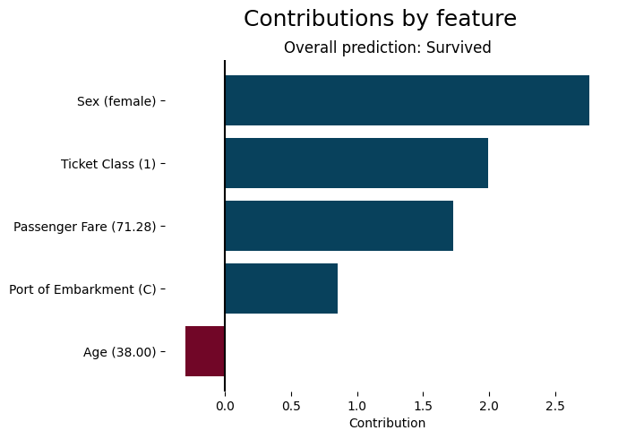
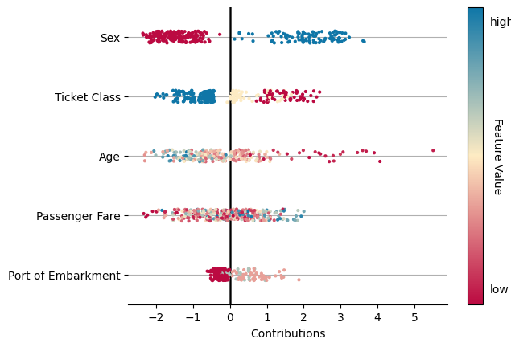

# 🚀 Quickstart

### Your First Explanation

In this tutorial, we will walk through getting an explanation using a pre-made `RealApp` object on the Titanic dataset. We will explain why a specific passenger is predicted to have survived the sinking of the Titanic.

We start by loading in the pre-made `RealApp` object. In the next section, we will introduce the process of making this object.

```python
import pyreal.sample_applications.titanic as titanic

real_app = titanic.load_titanic_app()
sample_data, _ = titanic.load_titanic_data(n_rows=300)
```

We can get the model's prediction on a row of data using the `real_app.predict()` function:

<pre class="language-python"><code class="lang-python"><strong>passenger_id = 1
</strong>predictions = real_app.predict(sample_data)

print("Passenger %s is predicted to have %s" % 
      (passenger_id, ["Died", "Survived"][predictions[passenger_id]]))
      
# OUTPUT: Passenger 1 is predicted to have Survived
</code></pre>

We can can generate explanations using the `produce()` functions. Let's try generating a local feature contribution object, which explains how much each feature value in an input row contributed to the model's prediction:

```python
explanation = real_app.produce_local_feature_contributions(sample_data)
plot_top_contributors(explanation[1], prediction=predictions[passenger_id])
```

<figure><figcaption><p>Feature contributions for passenger 1 in the Titanic Dataset. Blue bars indicate and increased prediction of survival, red bars indicate a decreased prediction of survival.</p></figcaption></figure>

We can see here that the fact that this passenger was female and in first class most significantly increased her predicted chance of survival.

### Making a new RealApp

To make a RealApp object for a new application to generate explanations, you will need:

1. The trained model
2. The training data and targets (in their original format)
3. The relevant transformers (see the [transformer guide](../developing-applications/working-with-transformers.md) in the developing applications documentation)
4. Optionally, a dictionary of default feature names to more descriptive feature strings

```python
import pyreal.applications.titanic as titanic
from pyreal.transformers import ColumnDropTransformer, MultiTypeImputer

# Load in data
x_orig, y = titanic.load_titanic_data()

# Load in feature descriptions -> dict(feature_name: feature_description, ...)
feature_descriptions = titanic.load_feature_descriptions()

# Load in model
model = titanic.load_titanic_model()

# Load in list of transformers
transformers = titanic.load_titanic_transformers()
```

With this information, we can create a RealApp object:

<pre class="language-python"><code class="lang-python">from pyreal import RealApp

<strong>realApp = RealApp(model, x_orig, y_orig=y,
</strong>                  transformers=transformers,
                  feature_descriptions=feature_descriptions,
                  )
</code></pre>

We can now generate and visualize explanations as above:

```python
explanation = real_app.produce_local_feature_contributions(sample_data)
swarm_plot(explanation, type="strip")
```

<figure><figcaption><p>Overall summary of feature contributions for all rows in the sample dataset. Points further to the right indicate an increased prediction of survival from those feature values.</p></figcaption></figure>


