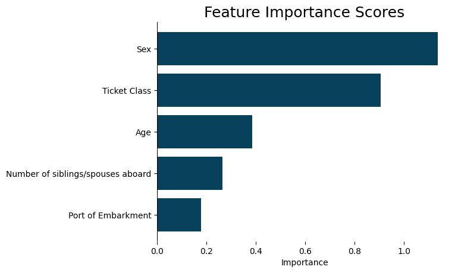

# Sample application


All code for this quickstart guide can be found in the corresponding [tutorial script](https://github.com/sibyl-dev/pyreal/blob/dev/tutorials/quickstart.ipynb).


### Introduction to RealApps

In this tutorial, we will walk through getting an explanation using a pre-made `RealApp` object on the Titanic dataset. We will explain why a specific passenger is predicted to have survived the sinking of the Titanic.

We start by loading in the pre-made `RealApp` object.

```python
from pyreal.sample_applications import titanic

realapp = titanic.load_app()
X = titanic.load_data(n_rows=300)
```

We can get the model's prediction on a row of data using the `.predict()` function:

```python
predictions = realapp.predict(X)

passenger_id = 1
print(f"Passenger {passenger_id} is predicted to have {predictions[passenger_id]}")
      
# OUTPUT: Passenger 1 is predicted to have Survived
```

We can generate explanations of model predictions using the `.produce_[EXPLANATION_TYPE]` functions. Let's generate a local feature contribution object, which explains a model prediction for a passenger by explaining how much each feature (input) value contributed to the final prediction.

We can visualize the resulting explanation using the `visualize` module.

```python
from pyreal.visualize import feature_bar_plot

contributions = realapp.produce_feature_contributions(X)
feature_bar_plot(contributions[passenger_id], 
                 prediction=predictions[passenger_id])
```

<figure><figcaption><p>Feature contributions for passenger 1 in the Titanic Dataset. Blue bars indicate and increased prediction of survival, red bars indicate a decreased prediction of survival.</p></figcaption></figure>

We can see here that the fact that this passenger was female and in first class most significantly increased her predicted chance of survival.

### Creating RealApps

To make a new RealApp for an application, you will need:

1. The training data and target values (or ground-truth values for the quantity your ML model predicts). We refer to input data as x and target values as y.
2. Any data transformers that prepare the data for predictions, and possibly additional transformers that make the data easier to understand. The Data Preparation and Modeling guides give more details on selecting these transformers.
3. A trained model. This can be any object with a .predict() function that takes an input and outputs a prediction, such as an sklearn estimator or a pytorch neural network.
4. Optionally, a dictionary of default feature names to more descriptive feature strings
5. Optionally, a function that formats model predictions into a readable format.

In the cell below we load in or create these five components for our sample Titanic application. See the [_Quickstart: Your Own Application_](quickstart/your-own-application.md) tutorial for instructions on how to prepare these yourself.

```python
# 1. Load in data
x, y = titanic.load_data(n_rows=300, include_targets=True)

# 2. Load in Transformers
transformers = titanic.load_transformers()

# 3. Load in trained ML model
model = titanic.load_model()

# 4. Create readable feature descriptions
feature_descriptions = {
    "PassengerId": "Passenger ID",
    "Pclass": "Ticket Class",
    "SibSp": "Number of siblings/spouses aboard",
    "Parch": "Number of parents/children aboard",
    "Ticket": "Ticket Number",
    "Fare": "Passenger Fare",
    "Cabin": "Cabin Number",
    "Embarked": "Port of Embarkment",
}

# 5. Set up prediction format function (converts True/False predictions to "Survived/Died"
def boolean_to_description(prediction):
    return "Survived" if prediction else "Died"
```

With this information, we can create a RealApp object:

```python
from pyreal import RealApp

realapp = RealApp(model, x, y, 
                  transformers=transformers,
                  feature_descriptions=feature_descriptions,
                  pred_format_func=boolean_to_description)
```

We can now generate and visualize explanations as above:

```python
importance_scores = realapp.produce_feature_importance()
feature_bar_plot(importance_scores)
```

<figure><figcaption><p>The overall feature importance scores for our ML model. Generally, our model considers Sex to be the most important peice of information in deciding whether someone survived the sinking of the Titanic, followed by Ticket Class and Age.</p></figcaption></figure>
