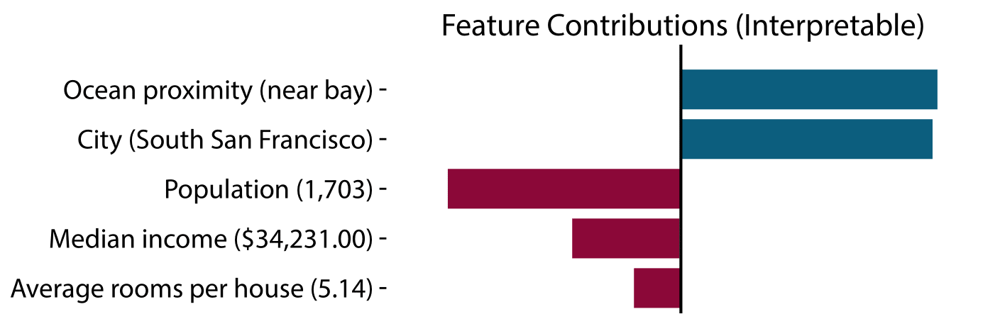
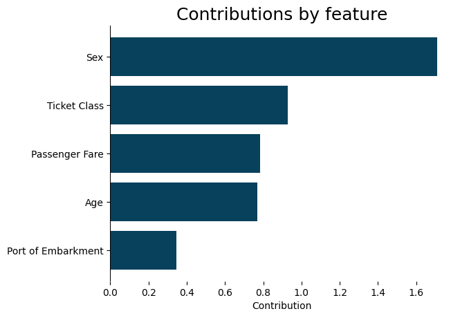

# Introduction to explanations

Pyreal offers a variety of explanation types to help you better understand your model's predictions. In this guide, we introduce you to a few common explanation types, and how to understand their outputs.

## Local Explanations

Local explanations explain an individual prediction. For example, the following is an example of a local explanation:

> This house is predicted to cost $105,000 because of its size and location" is a local prediction.&#x20;

### Feature contributions

#### Overview

Feature contribution explanations explain how much the value of each feature contributed to the model's prediction on a given input. Depending on the algorithm used to compute them, contribution could be in the same unit as the model output...

> The fact that this house is in the city of Cambridge increased it's price by $15,000 over similar houses in other areas.

... or a unitless, relative value:

> The fact that this house is in Cambridge greatly increased its price, while the fact that it is made of brick slightly increased its predicted price.&#x20;


Remember that most machine learning model explanations, including feature contributions, are NOT explaining any \*cause\*. We do not know if the house price increased \*because\* the house is made of brick, or if brick houses are simply correlated with higher house prices than other materials.


Feature contributions can be **positive**, meaning they increase the model's prediction, or **negative**, meaning they decrease the model prediction.

Feature contribution explanations also come with **average** (for numeric features) or **mode** (for categorical features) values. These values allow users to compare this value to the rest of the dataset, and offer context for the explantantion. For example, consider the context offered by providing the average and mode in this explanation:

> The average house size in this area is 1,800 square feet, but this house is 2,900 square feet. The size of this house increases it's predicted price by $60,000.&#x20;
>
> Most houses in this neighborhood have garages, but this one does not. The lack of a garage decreases the predicted price by $5,900.&#x20;

#### Visualizing

Feature contributions can be visualized using bar plots, like the ones generated by Pyreal's `plot_top_contributors` function:

<figure><figcaption>
Feature contribution explanation for house prices. The red bars represent negative contributions, while the blue bars represent positive contributions.
</figcaption></figure>

Alternatively, you can plot the feature contributions of many items in a dataset together to get a better sense of the model's predictions overall, such as using Pyreal's `swarm_plot` function:

<figure><figcaption></figcaption></figure>

## Global Explanations

Global explanations explain the model's predictions in general, without considering an specific instances. For example:

> House price predictions increase the most when houses are in expensive neighborhoods, are very large, or are made of high-quality materials.&#x20;

### Feature Importance

Feature importance explanations give an overall importance score to each feature in the dataset. This score is usually a unitless, relative importance score. For example, the following are all feature importance explanations:

> * Location is extremely important to the model.&#x20;
> * Yard size is a little important.&#x20;
> * House number is not used at all by the model.

Like **feature contributions**, you can visualize importance scores using a bar plot, like Pyreal's `plot_top_contributors` function:

<figure><figcaption></figcaption></figure>
