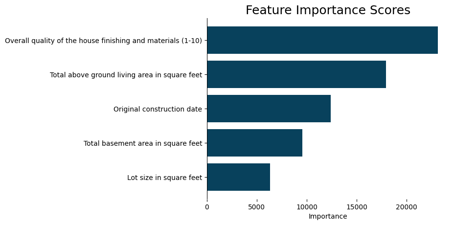
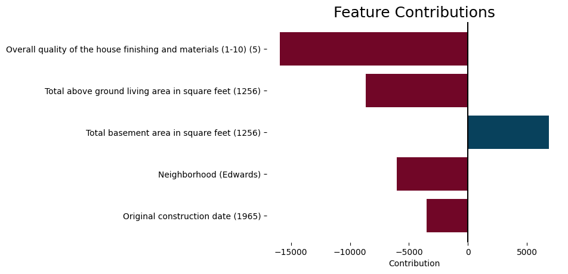
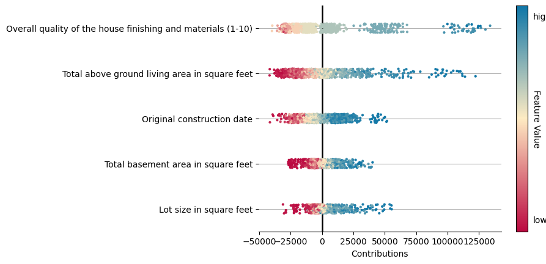
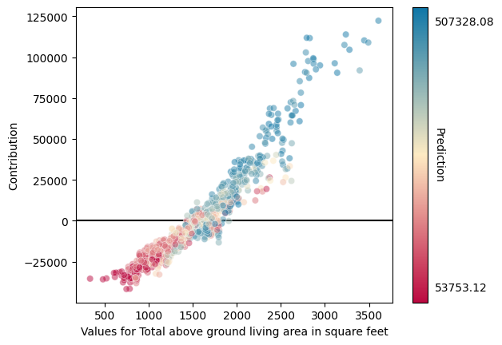

# Visualization


The full code for this and all other user guides can be found in our [user guide tutorial](https://github.com/sibyl-dev/pyreal/blob/dev/tutorials/user\_guide.ipynb).


Pyreal's visualize module includes several functions that take in RealApp output directly to generate explanation plots.


All visualization functions take in many customization parameters. See the[ API reference](https://sibyl-ml.dev/pyreal/api\_reference/visualize.html) for more information.


## Feature Bar Plot

The feature bar plot can visualize general feature importance scores...

```python
from pyreal.visualize import feature_bar_plot

feature_bar_plot(importance_scores)

feature_bar_plot(contributions["House 201"]
```

<figure><figcaption></figcaption></figure>

... or contribution scores for a single input

```python
feature_bar_plot(contribution_scores["House 101"])
```

<figure><figcaption></figcaption></figure>

## Strip Plot

Strip plots are an effective way to visualize feature contributions for multiple inputs at a time, to understand the general trends of how the ML model uses features.

To increase the amount of information displayed in these plots, you can generate feature contributions for the full training set.

```python
from pyreal.visualize import strip_plot

training_set_contributions = realapp.produce_feature_contributions(x_train)
strip_plot(training_set_contributions)
```

<figure><figcaption></figcaption></figure>

## Feature Scatter Plot

Scatter plots allow you to investigate how the model uses a specific feature, across the full range of that feature's values:

```python
from pyreal.visualize import feature_scatter_plot

# Optionally pass in predictions to color the plot by prediction
predictions = realapp.predict(x_train, format=False)

feature_scatter_plot(training_set_contributions, 
                     "Total above ground living area in square feet", 
                     predictions=predictions)
```

<figure><figcaption></figcaption></figure>

## Example Table

To get a clean table comparing the feature values of a input data to those of similar examples, you can use the `example_table` function:

```python
from pyreal.visualize import example_table

example_table(similar_houses["House 101"])
```

This will give you a table like:

|                | Ground Truth | Lot size in square feet | Neighborhood | ... |
| -------------- | ------------ | ----------------------- | ------------ | --- |
| Original Input | N/A          | 9937                    | Edwards      | ... |
| House 984      | $144,500.00  | 8562.0                  | Edwards      | ... |
| House 1004     | $149,900.00  | 17755.0                 | Edwards      | ... |

